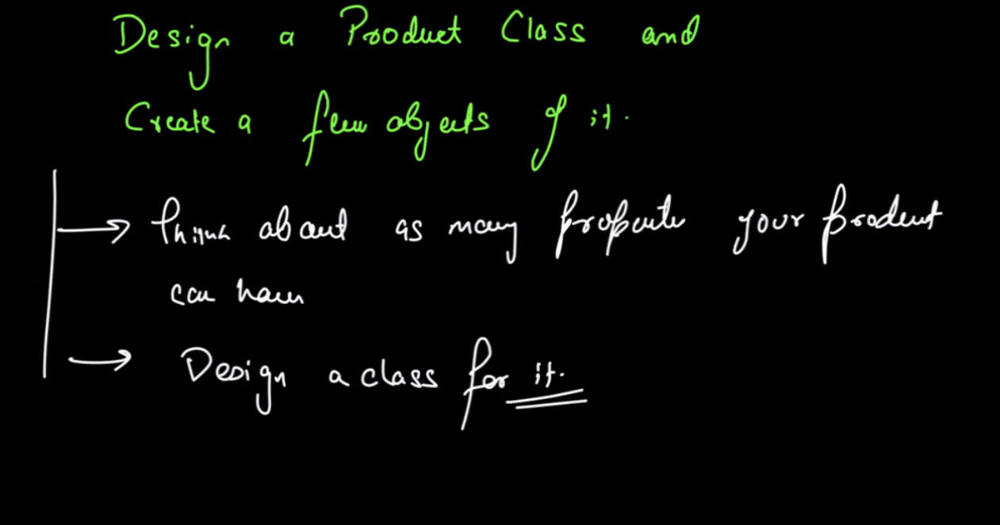

```Java
class Product{
    private string name;
    private string description;
    private int cost;

    public void Product(string name,string description,int cost){
        this.name=name;
        this.description=description;
        this.cost=cost;

    }
    public string getProductName(){
        return this.name;
    }
    //all getter and setter
}
public class ProductObj{
    public static void main(string arg){
        Product p1=new Product("iphone 13","iphone",70000)
    }

}
```
