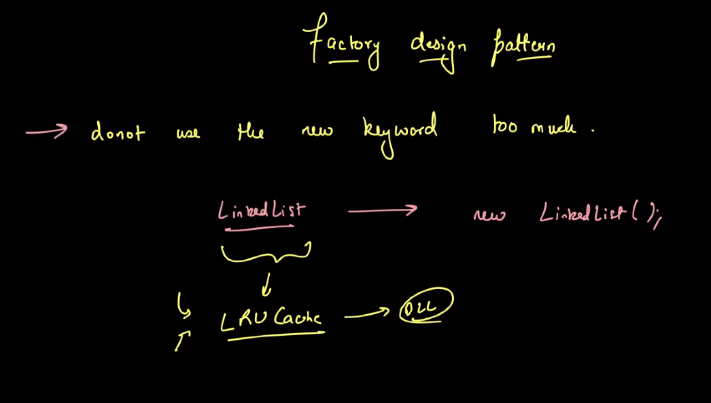

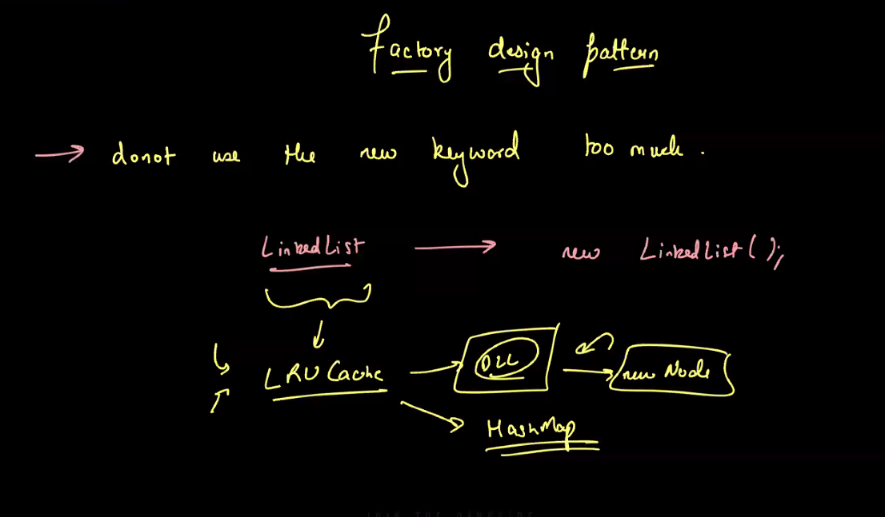

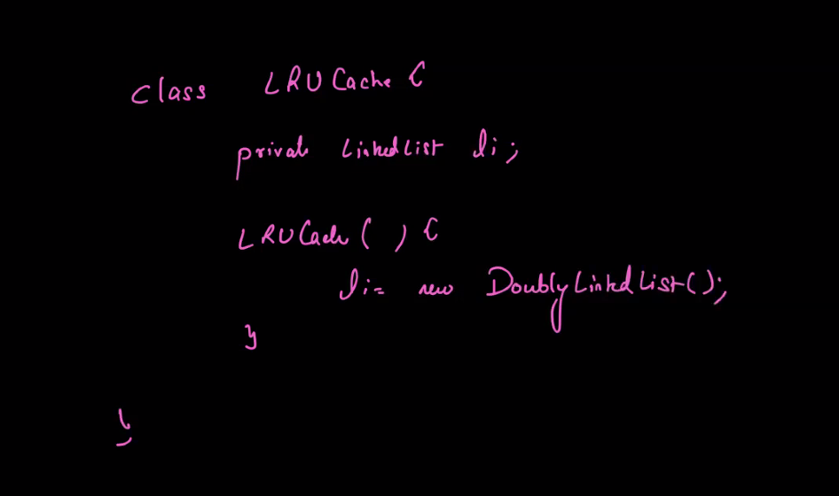

violating dependency inversion principle: we should not depend on concrete class

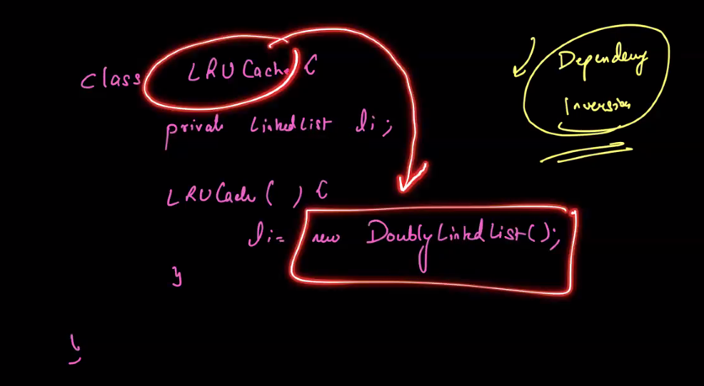

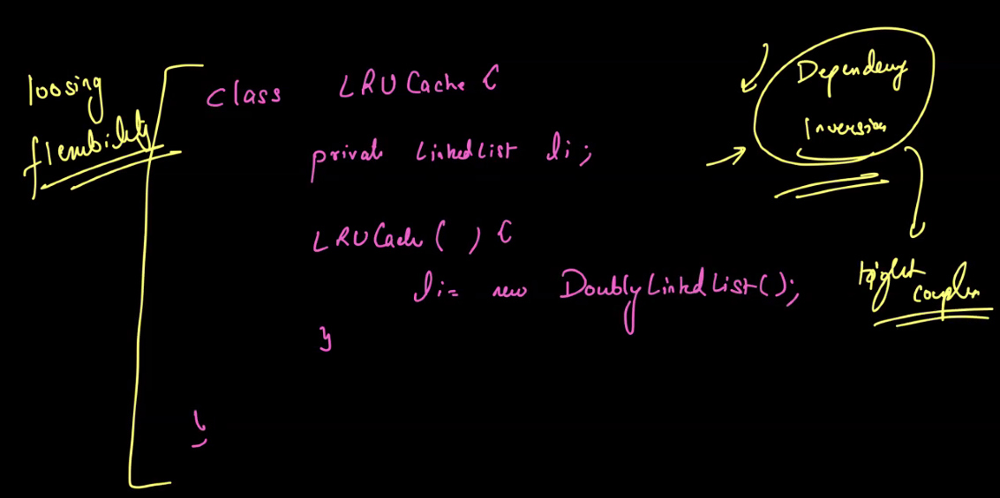

- Dependency injection
- 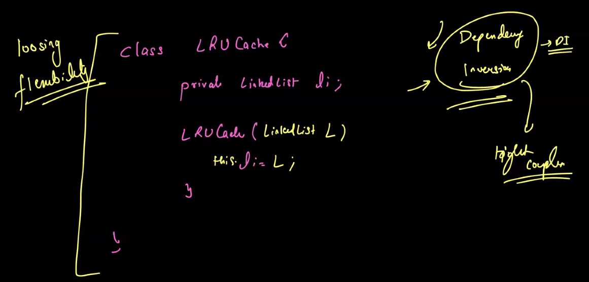
- resolve dependency inversion using dependency injection
- 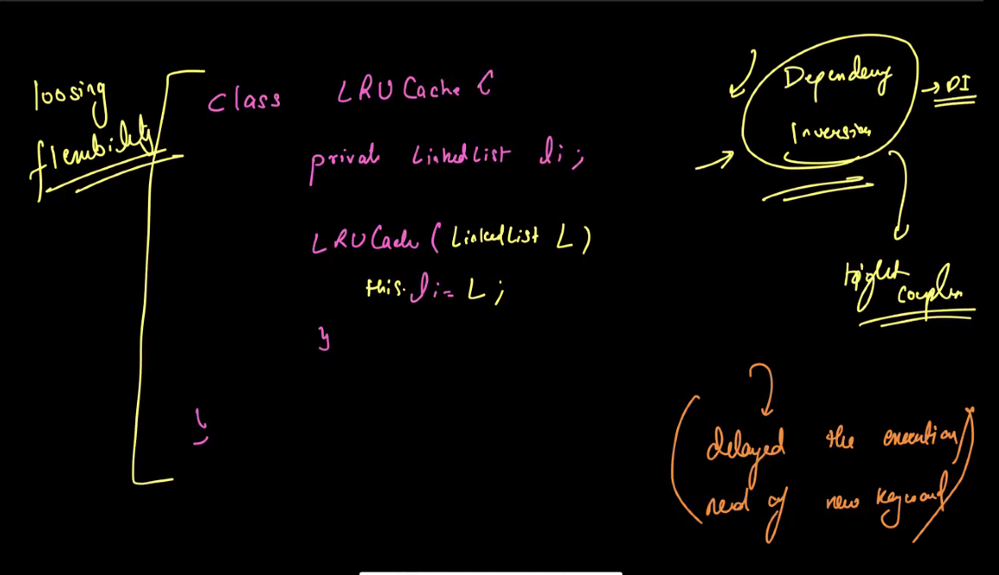
- https://spring.io/blog/2011/08/09/what-s-a-factorybean
- 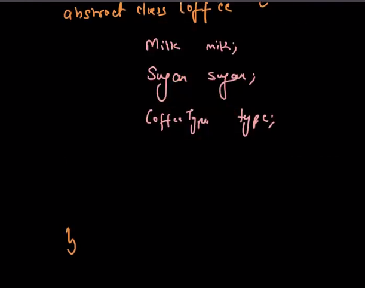
- 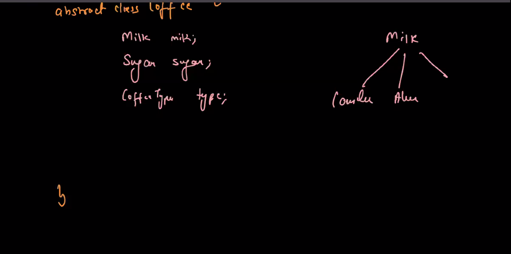
- 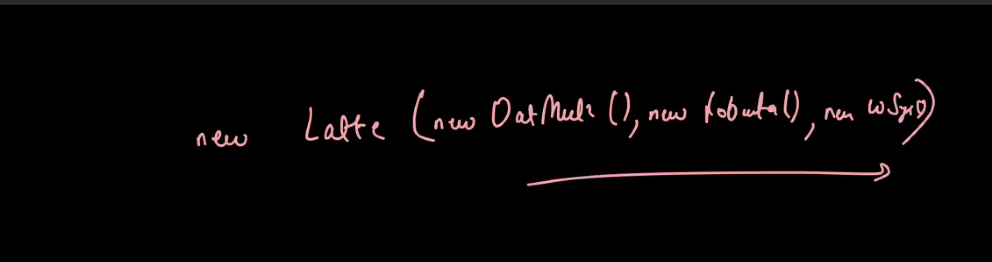
- 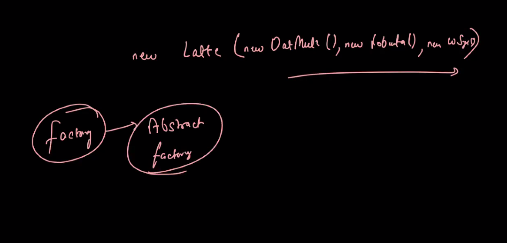
- 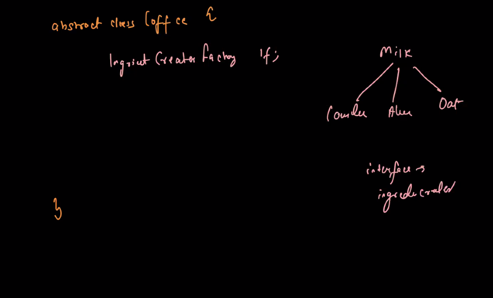
- 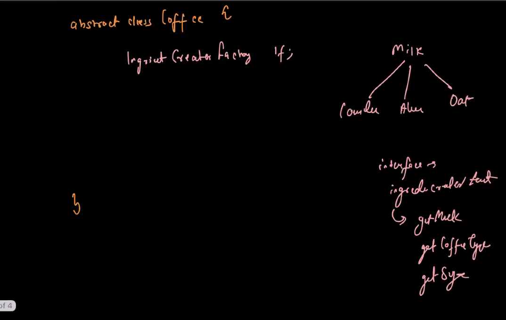
- 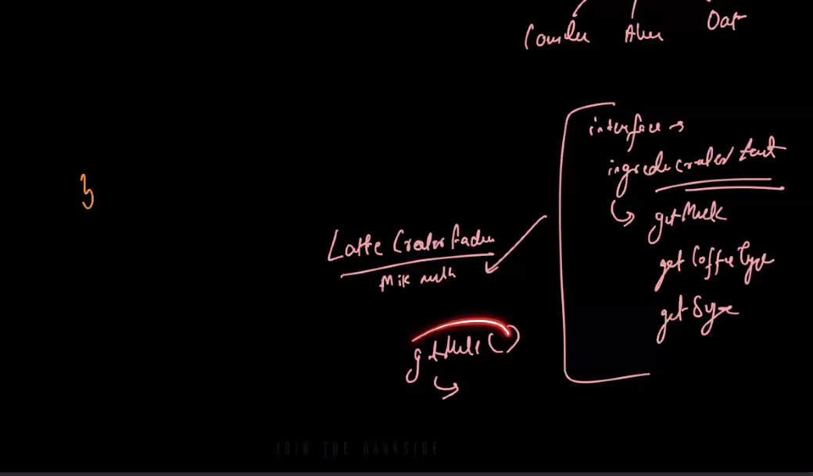
- Abstract design pattern: Family of similar object
